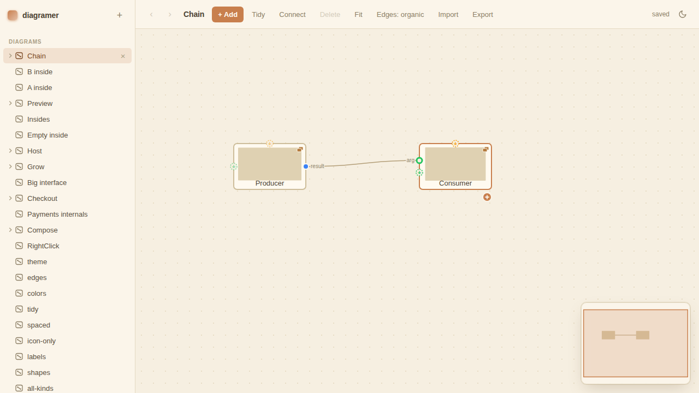
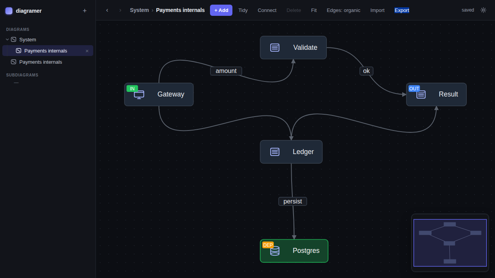
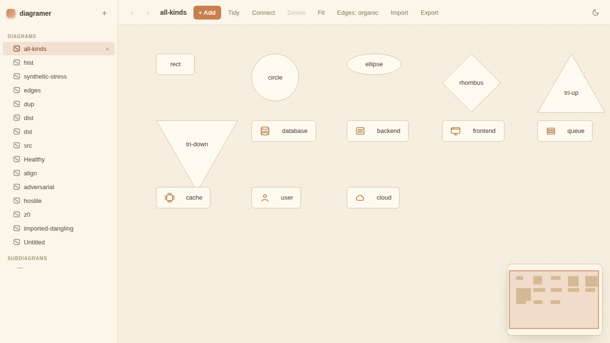
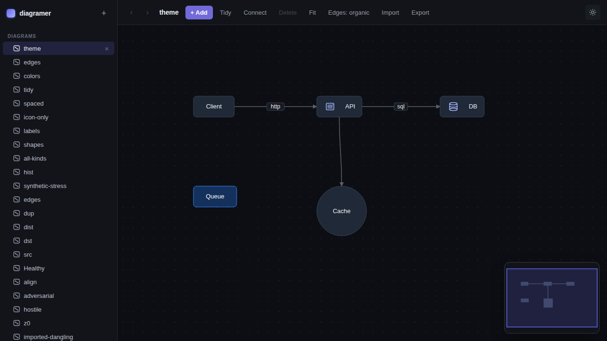
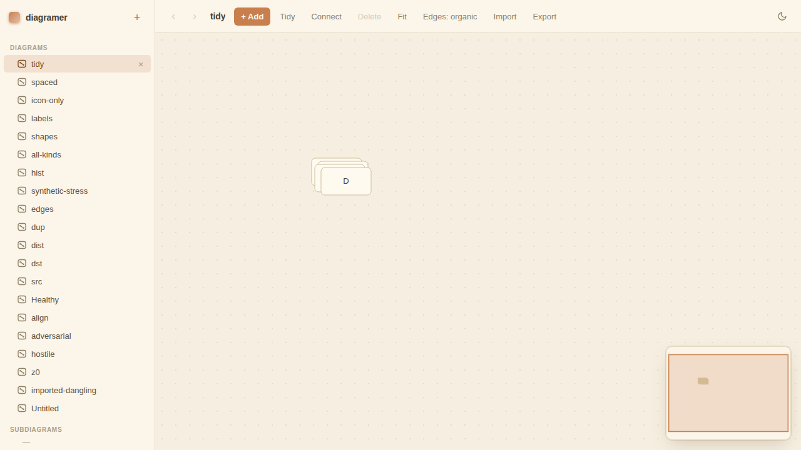
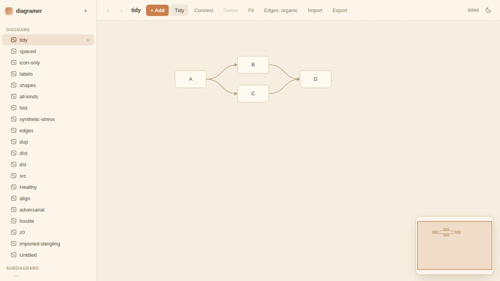

<div align="center">

# diagramer

**A local-first, AI-first diagram tool. One Go binary. Zero cloud.**

[](https://go.dev)
[](#license)
[](https://modelcontextprotocol.io)
[](#install)
[](https://github.com/MiguelAguiarDEV/diagramer/stargazers)

Build composable system diagrams in a tab you can close — your data stays on disk, your agent can edit it over MCP, and there is no service to run, no account to make, and no bundler to babysit.

<br/>


<sub>↑ 50-second walkthrough: create nodes → make one a subdiagram → add typed ports → wire it all together.<br/>
<em>AI-generated illustrative animation (Remotion + Claude) — recreates the real app's UI for pacing; it isn't a screen recording.</em></sub>

</div>

---

## Why diagramer?

- **Local-first.** Diagrams are plain JSON files under `./data`. Diff them. Commit them. Grep them. No database, no SaaS, no telemetry.
- **AI-first.** The same binary runs as an [MCP](https://modelcontextprotocol.io) server, so Claude (or any MCP client) can build and refactor diagrams directly. UI and agent share a directory — refresh the tab and the AI's edits are there.
- **One binary, no toolchain.** `go build` produces a ~12 MB static executable that embeds the entire UI. Open `localhost:7777` and go.
- **Composition that scales.** Any node can host a nested subdiagram with typed interface ports (`in` / `out` / `dep`) — a system map you can drill into instead of one wall-sized canvas.
- **Sane defaults.** Auto-layout, Figma-style alignment guides, undo/redo, dark + warm-vanilla light themes, SVG/PNG/JSON export — all in vanilla SVG + JS. ~4 000 lines of frontend, no build step.

## Highlights

<table>
  <tr>
    <td width="50%" valign="top">
      <br/>
      <strong>Composable subsystems.</strong> Containers expose <code>in</code> / <code>out</code> / <code>dep</code> ports inferred from their interior. Wires bind to specific ports, not just to boxes.
    </td>
    <td width="50%" valign="top">
      <br/>
      <strong>Drill in, drill out.</strong> Double-click a container to enter; breadcrumb to leave. The interface is the source of truth — tag a node Input/Output/Dependency, the parent updates.
    </td>
  </tr>
  <tr>
    <td width="50%" valign="top">
      <br/>
      <strong>Shapes + stencils.</strong> Rectangles, circles, ellipses, rhombuses, triangles, plus icon stencils for database / backend / frontend / queue / cache / user / cloud.
    </td>
    <td width="50%" valign="top">
      <br/>
      <strong>Two themes.</strong> Slate dark and warm-vanilla light, with a theme toggle that persists. Per-node colors compose with the theme via CSS custom properties.
    </td>
  </tr>
</table>

<details>
<summary><strong>Auto-layout — before / after</strong></summary>

| Before | After (`Tidy`) |
|---|---|
|  |  |

The layered layout (`internal/diagrams/layout.go`) groups nodes into dependency columns. Available in the UI, via the CLI (`./diagramer layout`), and over MCP (`auto_layout`).
</details>

## Quick start

```sh
git clone https://github.com/MiguelAguiarDEV/diagramer.git
cd diagramer
make run          # or: go run ./cmd/diagramer
```

Open <http://127.0.0.1:7777>. Hit `+ Add`, draw some boxes, drag the **+** handle on a node to connect them. That's it.

## Install

```sh
# build a static binary (≈12 MB, no runtime deps)
make build
./diagramer
```

Flags:

| Flag    | Default            | Meaning                                |
|---------|--------------------|----------------------------------------|
| `-addr` | `127.0.0.1:7777`   | HTTP listen address                    |
| `-data` | `./data`           | Directory for `index.json` + diagrams  |
| `-mcp`  | _off_              | Run as an MCP server over stdio        |

## Usage

### HTTP UI

`./diagramer` serves the embedded SVG/JS app at `-addr`. Keyboard:

| Shortcut             | Action                          |
|----------------------|---------------------------------|
| `+ Add` / right-click| New node / context menu         |
| Drag node **+**      | Connect to another node         |
| `F`                  | Fit to view                     |
| `Ctrl/Cmd + Z` / `Y` | Undo / redo                     |
| Double-click container | Drill into its subdiagram     |
| `Alt + ←` / `Alt + →`| Navigate drill history          |
| Click theme icon     | Toggle dark / light             |

Diagrams autosave with ETag conflict detection. The HTTP API at `/api/diagrams` is the same surface the UI uses — handy for scripting.

### CLI

The same binary doubles as a CLI that operates directly on the data directory, no server required. Put `-data` **before** the subcommand:

```sh
./diagramer create -data ./data "My Diagram"   # → prints the new id
./diagramer import -data ./data in.json        # create from JSON (dangling edges pruned)
./diagramer list   -data ./data                # id · name · counts · kind
./diagramer get    -data ./data <id>           # full diagram as JSON
./diagramer layout -data ./data <id>           # auto-layout (tidy)
./diagramer export -data ./data <id> out.json  # write JSON (omit path → stdout)
./diagramer delete -data ./data <id>
```

### MCP — let an agent edit your diagrams

Run with `-mcp` to expose the same engine as an MCP server over stdio. Any MCP client (Claude Desktop, Cursor, etc.) can then drive it:

```sh
./diagramer -mcp -data ./data
```

**Claude Desktop** — add to `~/Library/Application Support/Claude/claude_desktop_config.json` (macOS):

```json
{
  "mcpServers": {
    "diagramer": {
      "command": "/absolute/path/to/diagramer",
      "args": ["-mcp", "-data", "/absolute/path/to/data"]
    }
  }
}
```

The HTTP UI and the MCP server share `./data`, so refreshing the browser tab shows whatever the agent built.

**Exposed tools (15):**

| Tool                  | What it does                                                              |
|-----------------------|---------------------------------------------------------------------------|
| `list_diagrams`       | Diagram metadata (id, name, counts, subdiagram refs)                      |
| `get_diagram`         | Full diagram (nodes / edges / viewport)                                   |
| `create_diagram`      | New diagram, returns id                                                   |
| `rename_diagram`      | Rename by id                                                              |
| `delete_diagram`      | Delete by id                                                              |
| `add_node`            | Add a node (kind, position optional — auto-placed, with `fill`/`stroke`)  |
| `update_node`         | Edit label / position / kind / colors / `subdiagram_id`                   |
| `delete_node`         | Drop a node (incident edges are cleaned up)                               |
| `add_edge`            | Add an edge (with optional label / curvature)                             |
| `update_edge`         | Edit edge label / curvature / ports                                       |
| `delete_edge`         | Drop an edge                                                              |
| **`add_graph`**       | Build a whole subgraph atomically (nodes reference each other by `key`)   |
| **`create_subdiagram`** | Create + link a fresh diagram to a host node                            |
| **`auto_layout`**     | Tidy a diagram into dependency columns                                    |
| **`set_edge_style`**  | Switch a diagram between `organic` (bezier) and `synthetic` (orthogonal)  |

> **Tip.** `add_graph` is the efficient way to construct a diagram — one call instead of N. Pair it with `auto_layout` and you're done.

## Concepts

### Subdiagrams

A node with `data.subdiagramId` references another diagram as its interior. Composition is **by reference**: a subdiagram is just a normal diagram (listable, renameable, reusable, even self-referential — recursion is allowed and won't loop). Double-click to drill in; the title bar shows a clickable breadcrumb. The sidebar mirrors the containment tree (VS Code-explorer style) and auto-reveals the active path.

### Interface ports

A subdiagram has an interface that behaves like a function signature. Tag any inner node with `data.port`:

- **`"in"`** → left-side port on every container that references this diagram (entry).
- **`"out"`** → right-side port (return).
- **`"dep"`** → top-side port (a DB / API the inside relies on).

The container surfaces those automatically: `in` / `dep` render hollow ("plug here"), `out` filled ("produced here"). Drop a wire onto a port disc to bind it — the edge stores `sourcePort` / `targetPort` (the inner node id) and re-anchors as the inside is rearranged.

Inside a subdiagram, mark/clear a node's role from its context menu, or create a port node directly via **+ Add → Interface port**.

### Data model

```jsonc
Diagram { id, name, nodes[], edges[], component?, viewport, createdAt, updatedAt }
Node    { id, kind?, position{x,y}, data{ label, fill?, stroke?, subdiagramId?, port? } }
Edge    { id, source, target, sourcePort?, targetPort?, label?, curvature?{ox,oy} }
```

The shape mirrors React Flow's `{ nodes, edges, viewport }` for familiarity. Storage is one JSON file per diagram under `./data/diagrams/`, plus an `index.json`. Writes are atomic.

## Architecture

```
┌───────────── single Go binary ──────────────┐
│                                             │
│  ┌──────────┐    ┌──────────┐    ┌────────┐ │
│  │  HTTP    │    │   MCP    │    │  CLI   │ │
│  │  /api    │    │  stdio   │    │ subcmd │ │
│  └────┬─────┘    └────┬─────┘    └────┬───┘ │
│       └───────────────┼───────────────┘     │
│                       ▼                     │
│              ┌──────────────────┐           │
│              │ diagrams.Service │           │
│              └────────┬─────────┘           │
│                       ▼                     │
│              ┌──────────────────┐           │
│              │ JSONFileRepo     │  → ./data │
│              └──────────────────┘           │
│                                             │
│  Embedded UI (cmd/diagramer/web/*)          │
│  vanilla SVG + JS, no build step            │
└─────────────────────────────────────────────┘
```

- **Backend.** Go stdlib `net/http` + `embed`. Single `Service` interface; `JSONFileRepo` for storage with atomic writes and ETag-based conflict detection.
- **Frontend.** ~3 500 lines of vanilla JS rendering an SVG canvas. No npm, no bundler, no framework. Themed via CSS custom properties; `render()` rebuilds the `#nodes` / `#edges` layers from a single in-memory `diagram` object.
- **AI surface.** [`github.com/modelcontextprotocol/go-sdk`](https://github.com/modelcontextprotocol/go-sdk) over stdio, sharing the same `Service` as the HTTP layer.

See [`docs/architecture.md`](docs/architecture.md) for the full map and [`CLAUDE.md`](CLAUDE.md) for the agent-oriented orientation guide.

## Development

```sh
make build      # build static binary
make run        # go run from source (no build step)
make test       # Go unit + integration tests
make test-e2e   # Playwright E2E (installs deps, builds binary, drives a browser)
make clean      # remove binary
```

The E2E suite (`tests/`) sets diagrams up through the REST API, opens them in a real browser, and runs geometric assertions — no overlap, labels fit their shape, tidy-up columns are well-formed, theme toggles, subdiagram drill works, etc. Screenshots land in `tests/screenshots/` (gitignored).

If your environment can't reach the Playwright CDN, point `PW_CHROMIUM` at a pre-installed Chromium binary before `make test-e2e`.

## Repository layout

```
cmd/diagramer/         entrypoint + embed.go + CLI + web/
  web/                 the entire frontend (index.html, app.js, style.css)
internal/
  server/              HTTP layer (mux, handlers, ETag/If-Match)
  diagrams/            domain (model.go, service.go, layout.go)
  storage/             JSONFileRepo + atomic writes + index.json
  mcp/                 MCP server (15 tools)
tests/                 Playwright E2E (helpers.ts, *.spec.ts, screenshots/)
docs/                  PRD, architecture, media
```

## Roadmap

- [x] Subdiagrams with typed interface ports
- [x] MCP server with 15 tools (incl. `add_graph` and `auto_layout`)
- [x] Two themes, alignment guides, undo/redo
- [x] SVG / PNG / JSON export
- [ ] Edge bundling for very dense graphs
- [ ] Optional encrypted-at-rest data dir
- [ ] Windows code-signed release binaries

Have an idea? [Open an issue](https://github.com/MiguelAguiarDEV/diagramer/issues/new).

## Contributing

Issues and PRs welcome. A few principles to keep in mind ([`CLAUDE.md`](CLAUDE.md) has the long version):

1. **KISS, local-first, single binary.** No telemetry, no login, no cloud.
2. Prefer extending the existing `Service` / `Repository` interfaces over new abstractions.
3. Frontend features wire through `render()`; backend capabilities go on `Service` and (if AI-relevant) get an MCP tool.
4. Comments explain **why**, not what.

## License

MIT — see [LICENSE](LICENSE).

---

<div align="center">
<sub>Built with Go, vanilla SVG, and the conviction that diagrams should be files.</sub>
</div>
